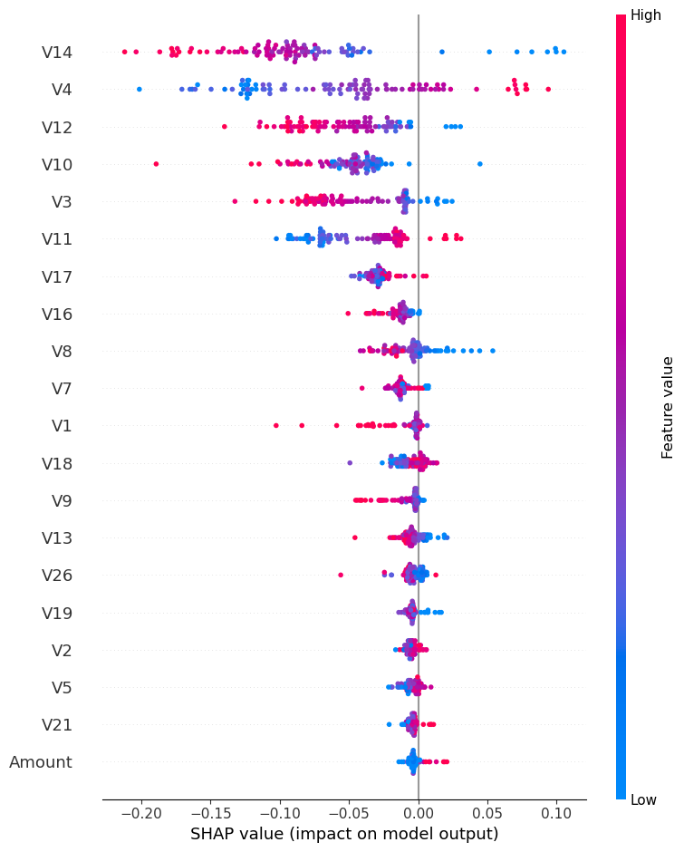
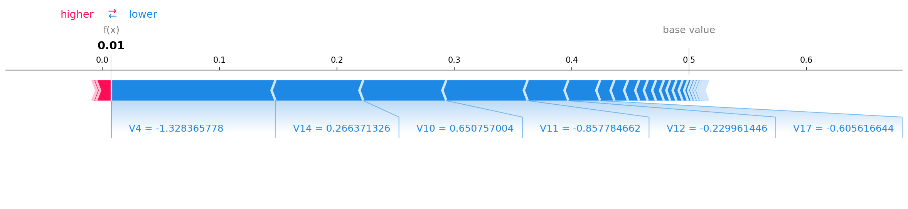
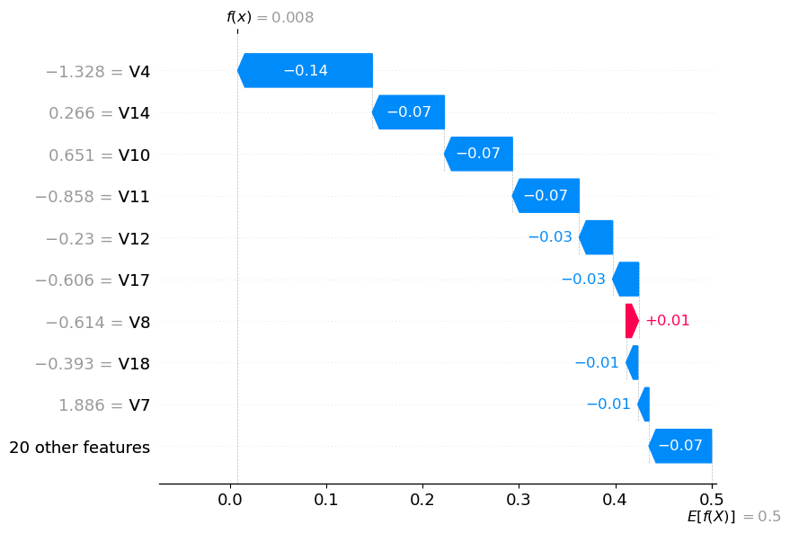

# 🛡️ Credit Card Fraud Detection System

🔴 [Live Demo](https://fraud-detection-project-pqp7wmyrprwnp8pifszums.streamlit.app/)

A machine learning system that detects fraudulent credit card transactions 
and explains *why* each transaction was flagged — not just whether it is fraud.

---

## 📌 The Problem

Only **0.17% of 284,807 transactions are fraudulent**. A model predicting 
"no fraud" always achieves 99.83% accuracy while catching zero fraud cases. 
This project solves that using SMOTE and measures performance with 
**Recall and F1 Score** — the metrics that actually matter for fraud detection.

---

## 📊 Results

| Model | Recall | Precision | F1 Score |
|-------|--------|-----------|----------|
| Logistic Regression | 0.9184 | 0.0563 | 0.1061 |
| Decision Tree | 0.7857 | 0.3598 | 0.4936 |
| XGBoost | 0.8673 | 0.6855 | 0.7658 |
| **Random Forest ✅** | **0.8265** | **0.8710** | **0.8482** |

**Random Forest** was selected — best balance of Recall and Precision.
> Logistic Regression had 91% Recall but only 5.6% Precision — it flags 
> almost everything as fraud, making it unusable in practice.

---

## 🔍 Explainable AI with SHAP

Most fraud models are black boxes. This project explains every prediction.

**Global Feature Importance — which features matter most?**



**V14, V4, and V12** are the strongest fraud signals.

**Why was this specific transaction flagged?**



The force plot shows exactly which features pushed this transaction's 
fraud probability from a base rate of 0.17% to a high-risk prediction.

**Waterfall Plot — feature-by-feature breakdown for one transaction**



Each bar shows exactly how much one feature pushed the prediction 
up (red) or down (blue) from the base rate.

---

## 🚀 Key Features

- **SMOTE Oversampling** — handles extreme class imbalance (578:1 ratio)
- **Random Forest Model** — 82.65% Recall on 284,807 real transactions
- **SHAP Explainability** — every prediction is fully auditable
- **Streamlit Dashboard** — real-time fraud checking with live explanations

---

## 🛠️ Tech Stack

Python · Scikit-learn · XGBoost · imbalanced-learn · SHAP · Streamlit · Pandas

---

## ▶️ Run Locally

```bash
git clone https://github.com/bhumika2398/fraud-detection-project.git
cd fraud-detection-project
pip install -r requirements.txt
streamlit run src/app.py
```

Download the dataset from [Kaggle](https://www.kaggle.com/datasets/mlg-ulb/creditcardfraud) 
and place it in `data/raw/`.

---

## 🧪 Test the App — High Risk Inputs

| Feature | Value |
|---------|-------|
| V14 | -15.0 |
| V4 | 8.0 |
| V12 | -12.0 |
| Amount | 800.0 |

---

## 📁 Dataset

[ULB Credit Card Fraud Detection — Kaggle](https://www.kaggle.com/datasets/mlg-ulb/creditcardfraud)  
284,807 real transactions · September 2013 · Features V1–V28 are PCA-transformed

---

*Built by Bhumika R*